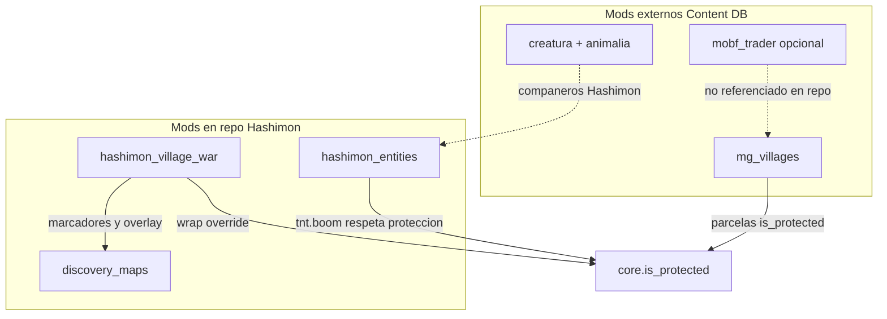
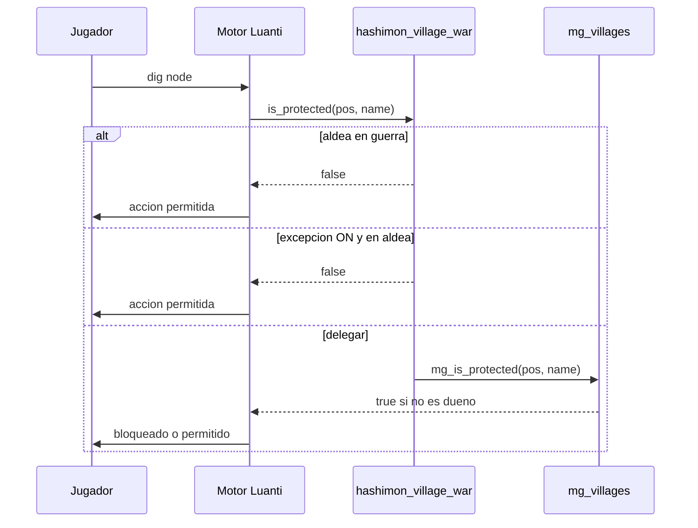

# Hashimon — Propiedad privada, aldeas, NPCs y mods de aldeanos

Paper técnico de referencia sobre **cómo funciona hoy** el ecosistema de aldeas y propiedad en el mundo 3D de Hashimon (Luanti), qué mods intervienen y qué queda planificado.

**Estado:** documentación del sistema actual (no spec futura)  
**Audiencia:** desarrollo backend, integración Luanti, diseño de juego  
**Última revisión:** 2026-08-10

---

## 1. Resumen ejecutivo

Hashimon **no implementa** un sistema propio de propiedad privada ni de aldeanos conversacionales en el repo. El mundo 3D delega la propiedad de parcelas al mod externo **mg_villages** (Content DB) y extiende ese comportamiento con **hashimon_village_war** (guerra de aldeas y excepción personal). La visualización de zonas en guerra vive en **discovery_maps**.

| Capa | ¿En repo? | Rol |
|------|-----------|-----|
| **mg_villages** | No (Content DB) | Generación de aldeas, parcelas, compra de casas, `core.is_protected` |
| **hashimon_village_war** | Sí | Override de protección (guerra / excepción por jugador) |
| **discovery_maps** | Sí | Marcadores de guerra + overlay rojo en `/map` |
| **hashimon_entities** | Sí | Compañeros Hashimon (lobo/sprite); no aldeanos |
| **mobf_trader** | No instalado | Traders del modpack villages-for-minetest (externo) |
| **NPCs LLM (“aldeanos”)** | Solo docs | [`LLM_INFERENCE_ARCHITECTURE.md`](LLM_INFERENCE_ARCHITECTURE.md) — no implementado en Luanti |
| **NPCs 2D** | Sí (`game/`) | [`game/OverworldMap.js`](../game/OverworldMap.js) — capa browser, desacoplada de Luanti |



**Operativo hoy:** aldeas procedurales con protección mg_villages, guerra `/vwar`, mapa con overlay, ataques Hashimon que respetan (o no) la protección según estado de guerra.

**Planificado, no shipped:** aldeanos con diálogo LLM, traders mobf_trader integrados en flujos Hashimon, propiedad fuera del modelo mg_villages.

---

## 2. Propiedad privada — mg_villages [externo]

### 2.1 Modelo de propiedad

**mg_villages** genera aldeas con parcelas (casas/lotes). Cuando la protección está activa, un jugador **no puede modificar** bloques en una parcela ajena hasta **comprar la casa** al sistema del mod. El mensaje típico al intentar romper o colocar bloques es:

> *"The inhabitants do not allow you any modifications"*

La configuración upstream vive en `mg_villages/config.lua`:

```lua
-- if set to true, players cannot modify spawned villages without buying the house from the village first
mg_villages.ENABLE_PROTECTION = true
```

Si `ENABLE_PROTECTION = false`, las aldeas generadas son editables por cualquiera (modo creativo de facto sobre estructuras del modpack).

### 2.2 Mecanismo técnico: `core.is_protected`

Luanti consulta la cadena global `core.is_protected(pos, player_name)` antes de permitir:

- cavar / colocar nodos
- explosiones del mod **tnt** (incluidas las de Hashimon)
- otras acciones que respeten protección

mg_villages registra su propio handler en esa cadena. **hashimon_village_war** envuelve el handler existente y puede devolver `false` (no protegido) en casos especiales antes de delegar a mg_villages.

### 2.3 APIs de mg_villages usadas por Hashimon

El código Hashimon **solo consume** estas superficies (el mod no está vendored en el repo):

| API | Uso en Hashimon |
|-----|-----------------|
| `mg_villages.ENABLE_PROTECTION` | Comprobar si el override de vwar debe activarse |
| `mg_villages.get_town_id_at_pos(pos)` | Resolver aldea en posición del jugador o del bloque |
| `mg_villages.all_villages[id]` | Metadatos `{ name, vx, vz, vh, vs }` para centro, bounds y mapa |

Campos relevantes de `all_villages[id]`:

- `name` — nombre visible de la aldea
- `vx`, `vz` — centro horizontal
- `vh` — altura de referencia
- `vs` — “size” del pueblo; Hashimon deriva el AABB de guerra como `vs * 3` en cada eje

### 2.4 Instalación

mg_villages **no** viene en [`3d-world/mods/`](../3d-world/mods/). Hay que habilitarlo en la pestaña **Content** de Luanti junto a los mods Hashimon. El script de instalación lo recuerda explícitamente:

```52:52:3d-world/util/install-hashimon-mods.sh
echo "  3. Content DB → enable hashimon mods + discovery_maps (symlinked) + mg_villages"
```

---

## 3. Aldeas procedurales [externo + lectura Hashimon]

### 3.1 Ecosistema de generación

Las aldeas en un mundo Minetest Game típico con modpack de villages provienen de:

- **mg_villages** — orquestación y towns
- **handle_schematics** — colocación de estructuras
- **cottages** y mods **village_*** — estilos (medieval, moderno, etc.)
- **mobf_trader** (opcional en el modpack) — NPCs comerciantes estáticos con los que se tradea al hacer clic derecho

Hashimon **no modifica** la generación ni el registro de parcelas. Solo **lee** IDs y coordenadas una vez que el mundo ya tiene aldeas.

### 3.2 Región “genesis” del mapa

**discovery_maps** (fork Hashimon) limita la exploración y el contador de tiles al `mapgen_limit` del mundo (p. ej. Hashiworld ~±31k bloques). Eso afecta dónde aparece niebla de guerra en `/map`, no la generación de aldeas en sí. Ver [`3d-world/mods/README.md`](../3d-world/mods/README.md) sección *Genesis map region*.

---

## 4. hashimon_village_war — extensión Hashimon [repo]

Mod: [`3d-world/mods/hashimon_village_war/`](../3d-world/mods/hashimon_village_war/)  
Namespace global: `hashimon_vwar`  
Dependencia dura: **mg_villages** (si falta, el mod no carga):

```3:6:3d-world/mods/hashimon_village_war/init.lua
if not core.get_modpath("mg_villages") or not mg_villages then
	core.log("warning", "[hashimon_village_war] mg_villages not found — mod inactive")
	return
end
```

Dependencias opcionales: `discovery_maps` (marcadores y overlay).

### 4.1 Override de protección

`protection.lua` guarda el handler original y lo envuelve:

```26:43:3d-world/mods/hashimon_village_war/protection.lua
local mg_is_protected = core.is_protected

core.is_protected = function(pos, name)
	if not mg_villages or not mg_villages.ENABLE_PROTECTION then
		return mg_is_protected(pos, name)
	end

	local village_id = mg_villages.get_town_id_at_pos(pos)
	if village_id and hashimon_vwar.is_village_at_war(village_id) then
		return false
	end

	if village_id and hashimon_vwar.player_exception_mode(name) then
		return false
	end

	return mg_is_protected(pos, name)
end
```

| Estado | Efecto sobre dig/place/TNT |
|--------|----------------------------|
| Aldea normal, jugador sin parcela | Protegido (mg_villages) |
| Aldea en **guerra** (`/vwar declare`) | **Desprotegida para todos** |
| Jugador con **modo excepción** (`/vwar exception`) | Desprotegida **solo para ese jugador** en cualquier aldea |
| Fuera de aldea | Sin cambio (resto de la cadena) |

El modo excepción persiste en meta del jugador: clave `hashimon_vwar:exception` = `"1"`.

### 4.2 Persistencia de guerras

Archivo: `<worldpath>/hashimon_vwar/war_villages.json`

```json
{
  "village_ids": ["town_123", "town_456"],
  "names": {
    "town_123": "Northwood",
    "town_456": "Eastvale"
  }
}
```

Operaciones principales en `storage.lua`:

- `declare_war(village_id)` — marca guerra, guarda nombre, sincroniza mapa
- `end_war(village_id)` / `end_all_wars()` — restaura protección normal
- `list_war_villages()` — lista ordenada para `/vwar status`

### 4.3 Comandos `/vwar`

| Comando | Efecto |
|---------|--------|
| `/vwar declare` | Declara guerra en la aldea donde está el jugador |
| `/vwar peace` | Termina guerra en la aldea actual |
| `/vwar peace all` | Termina todas las guerras |
| `/vwar exception` | Alterna bypass personal de protección |
| `/vwar status` | Lista guerras, excepción del jugador, aldea actual |
| `/vwar map [índice\|nombre]` | Abre `/map` centrado en aldea en guerra |

Implementación: [`commands.lua`](../3d-world/mods/hashimon_village_war/commands.lua).

### 4.4 Integración con discovery_maps

**Bounds de zona hostil** (`map_sync.lua`):

```18:32:3d-world/mods/hashimon_village_war/map_sync.lua
function hashimon_vwar.get_village_bounds(village_id)
	...
	local size = v.vs * 3
	return {
		min_x = v.vx - size,
		max_x = v.vx + size,
		min_z = v.vz - size,
		max_z = v.vz + size,
	}
end
```

**Marcadores globales** (visibles para todos en `/map`, no editables por jugadores):

- Fuente: `hashimon_vwar`
- ID: `vwar:<village_id>`
- Etiqueta: `⚔ <nombre>`
- API: `persistent_map.upsert_system_marker` en [`system-markers.lua`](../3d-world/mods/discovery_maps/system-markers.lua)

**Overlay rojo** por tile en `show_map` cuando `hashimon_vwar.tile_in_war_zone(tile_x, tile_z)` — color `#FF0000AA` sobre tiles descubiertos.

Los marcadores de jugador (`/markers`) y los marcadores de sistema están separados a propósito: los de guerra no aparecen en la GUI de gestión personal.

### 4.5 Combate Hashimon vs aldeas

Los orbes explosivos en [`attack.lua`](../3d-world/mods/hashimon_entities/attack.lua) llaman a `tnt.boom` si el mod **tnt** está cargado. El motor de TNT consulta `core.is_protected` por bloque afectado:

- Aldea **protegida** → no hay destrucción de bloques (explosión acotada o sin efecto según tnt)
- Aldea **en guerra** → destrucción permitida como TNT normal
- Jugador con **excepción** → puede afectar parcelas ajenas solo él (según reglas tnt + posición)

Documentado también en [`3d-world/mods/README.md`](../3d-world/mods/README.md) sección *Protected villages*.

---

## 5. NPCs y “aldeanos” — qué existe hoy

### 5.1 Luanti 3D — sin mod de aldeano conversacional

No hay mod en [`3d-world/mods/`](../3d-world/mods/) que registre aldeanos, citizens, tenants ni diálogo de pueblo. Búsqueda en el repo: cero implementación Lua de `villager` / `aldeano` en el mundo 3D.

### 5.2 Compañeros Hashimon [repo] — no son aldeanos

| Aspecto | Detalle |
|---------|---------|
| Mod | `hashimon_entities` |
| Apariencia | Lobo 3D (Creatura + Animalia) o sprite fallback |
| IA | `tamed_stay`, `tamed_follow_owner` — mascota del jugador |
| Interacción | Stats, Shift+clic, `/hashimon attack` |
| Diálogo | Ninguno |

Registro del mob en [`companion.lua`](../3d-world/mods/hashimon_entities/companion.lua) vía `creatura.register_mob("hashimon_entities:companion", ...)`.

### 5.3 Traders del modpack mg_villages [externo, no integrado en repo]

El modpack **villages-for-minetest** puede incluir **mobf_trader**: NPCs estáticos dentro de aldeas para intercambio al clic derecho. Hashimon **no referencia** mobf_trader en código ni en el script de install; su presencia depende de lo que el operador del mundo habilite en Content DB.

Comportamiento típico upstream: NPCs **no deambulan** (diseño intencional del modpack para evitar NPCs caminando sin parar).

### 5.4 Aldeanos LLM [planificado]

[`LLM_INFERENCE_ARCHITECTURE.md`](LLM_INFERENCE_ARCHITECTURE.md) describe un bridge HTTP (`POST /npc/reply` o Ollama `/v1/chat/completions`) con contexto de coords, inventario y **estado vwar** (“Eastvale en guerra”). **No hay mod Luanti que lo implemente** todavía; el checklist incluye “Un NPC o comando de chat de prueba” como pendiente.

### 5.5 NPCs capa 2D browser [repo, separado]

[`game/OverworldMap.js`](../game/OverworldMap.js) define NPCs scriptados (`npcA`, `npcB`, …) con:

- `behaviorLoop` — patrulla o idle
- `talking` — eventos `textMessage`, `battle`, `addStoryFlag`

Esa capa es el RPG 2D en el navegador; **no comparte** estado con mg_villages, `hashimon_village_war` ni el servidor Luanti.

---

## 6. Flujos operativos

### A. Romper un bloque en aldea protegida



### B. Declarar guerra

1. Jugador dentro de aldea → `/vwar declare`
2. `mg_villages.get_town_id_at_pos` → `village_id`
3. `hashimon_vwar.declare_war` → escribe `war_villages.json`
4. `sync_war_map_markers` → marcadores `⚔` + refresh de `/map` abierto
5. Protección de esa aldea desactivada para todos hasta `/vwar peace`

### C. Ver aldea en guerra en el mapa

1. `/vwar map` o `/vwar map 2` o `/vwar map Northwood`
2. `resolve_war_map_target` → entrada de guerra
3. `center_map_on_coords` + `show_map`
4. Tiles en bounds muestran overlay rojo; marcador naranja en centro

### D. Ataque Hashimon en aldea

1. `/hashimon attack` o Shift+clic → orbe → `tnt.boom`
2. Por cada bloque candidato, motor consulta `is_protected`
3. Mismo árbol que flujo A: guerra = destrucción posible; paz = bloques de parcela intactos

---

## 7. Referencia rápida

### Comandos in-game (repo)

| Comando | Mod |
|---------|-----|
| `/vwar declare\|peace\|peace all\|exception\|status\|map` | hashimon_village_war |
| `/map`, `/map full`, `/markers`, `/mapgo`, `/mark` | discovery_maps |
| `/hashimon session\|starter\|sync\|attack` | hashimon_core + entities |

### Mods a habilitar en el mundo

| Mod | Obligatorio |
|-----|-------------|
| hashimon_core | Sí |
| hashimon_entities | Sí |
| hashimon_village_war | Si usas mg_villages |
| discovery_maps | Recomendado (mapa + overlay guerra) |
| mg_villages | Sí para propiedad/aldeas |
| creatura + animalia | Opcional (lobo 3D) |
| tnt | Incluido en Minetest Game (explosiones Hashimon) |
| mobf_trader | Opcional (traders upstream) |

### Instalación symlinks

```bash
cd 3d-world && ./util/install-hashimon-mods.sh
```

Luego en Luanti: Content → enable mods listados arriba + **mg_villages** desde Content DB. Reinicio completo (Cmd+Q) tras cambios en `minetest.conf`.

### Grafo de dependencias

```text
mg_villages (requerido para vwar)
    ↑
hashimon_village_war ──optional──→ discovery_maps
hashimon_core ──→ hashimon_entities ──optional──→ creatura, animalia, tnt
```

---

## 8. Limitaciones y roadmap

### Limitaciones actuales

1. **Propiedad:** toda la lógica de parcelas y compra de casas vive en mg_villages; Hashimon no tiene registro de dueños ni contratos propios.
2. **Aldeanos 3D:** no hay NPCs conversacionales en Luanti; mobf_trader no está integrado en flujos Hashimon.
3. **Guerra:** override binario (guerra = todo el mundo puede editar); no hay facciones, permisos granulares ni reparación automática post-guerra.
4. **Bounds de guerra:** AABB fijo `vs * 3`; puede no coincidir exactamente con límites de parcelas mg_villages.
5. **Capas desacopladas:** el juego 2D (`game/`) y el mundo Luanti no comparten NPCs ni estado de aldea.
6. **mg_villages no vendored:** este paper documenta APIs observadas desde Hashimon; el comportamiento exacto de compra/UI puede variar según versión del mod upstream.

### Roadmap sugerido (fuera de scope actual)

- Bridge LLM para aldeanos con contexto `vwar` — ver [`LLM_INFERENCE_ARCHITECTURE.md`](LLM_INFERENCE_ARCHITECTURE.md)
- Evaluar mobf_trader o mod NPC dedicado si se quieren comerciantes sin LLM
- API Hashimon para consultar “¿estoy en aldea en guerra?” desde otros mods
- Propiedad alternativa fuera de mg_villages (solo si el diseño lo exige)

---

## 9. Referencias

### Archivos en repo

| Archivo | Contenido |
|---------|-----------|
| [`3d-world/mods/hashimon_village_war/protection.lua`](../3d-world/mods/hashimon_village_war/protection.lua) | Wrap `core.is_protected` |
| [`3d-world/mods/hashimon_village_war/storage.lua`](../3d-world/mods/hashimon_village_war/storage.lua) | Persistencia JSON |
| [`3d-world/mods/hashimon_village_war/commands.lua`](../3d-world/mods/hashimon_village_war/commands.lua) | `/vwar` |
| [`3d-world/mods/hashimon_village_war/map_sync.lua`](../3d-world/mods/hashimon_village_war/map_sync.lua) | Mapa y bounds |
| [`3d-world/mods/discovery_maps/system-markers.lua`](../3d-world/mods/discovery_maps/system-markers.lua) | Marcadores de sistema |
| [`3d-world/mods/hashimon_entities/attack.lua`](../3d-world/mods/hashimon_entities/attack.lua) | Explosiones TNT |
| [`3d-world/mods/README.md`](../3d-world/mods/README.md) | Guía operativa mods |
| [`3d-world/util/install-hashimon-mods.sh`](../3d-world/util/install-hashimon-mods.sh) | Instalación |
| [`game/OverworldMap.js`](../game/OverworldMap.js) | NPCs 2D |

### Documentación upstream

- [Luanti Forum — mg_villages / ENABLE_PROTECTION](https://forum.luanti.org/viewtopic.php?t=13877)
- [Modpack villages-for-minetest (foro)](https://forum.minetest.org/viewtopic.php?f=9&t=13589)

### Relacionados Hashimon

- [`LLM_INFERENCE_ARCHITECTURE.md`](LLM_INFERENCE_ARCHITECTURE.md) — inferencia y NPCs planificados
