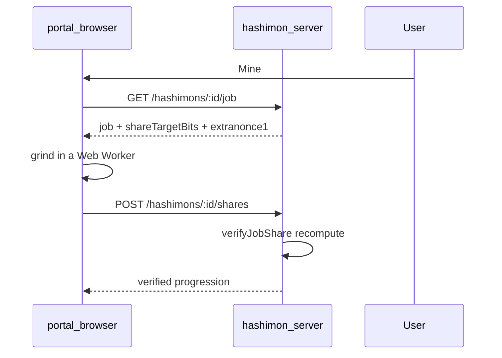

# Rabbit Mining → Hashimon Integration

Technical reference for replacing Hashimon's simulated local PoW with real proof-of-work (browser grind + server verify), using Rabbit/Spoon as architectural reference.

## Quick links

| Document | Purpose |
|----------|---------|
| [docs/HASHIMON_ADN_Y_EVOLUCION.md](./HASHIMON_ADN_Y_EVOLUCION.md) | ADN, compilador, evolución PoW, genesis elemental (español) |
| [docs/POW_SPEC.md](./POW_SPEC.md) | Byte-level PoW spec + golden test vectors |
| [server/src/modules/core/core/pow.ts](../src/modules/core/core/pow.ts) | `hashJob`, `verifyJobShare` (submitted shares), `verifyStoredPow` (stored best share), `leadingZeroBits` |
| [server/src/modules/mining/domain/mining.ts](../src/modules/mining/domain/mining.ts) | Job issuance + share submission |
| `genesis-portal/src/lib/mining.ts` + `mining-worker.ts` (sibling repo) | Browser client (fetch job → grind → POST); the original `game/` client no longer exists |

## Executive summary

Rabbit Mining in Block-Lotto is **not** browser PoW. It rents hashrate via `POST /rabbit/shots/request` → Caos Engine → Spoon, with results on `POST /api/v1/webhook/entropy`. The API trusts webhook nonces and never recomputes hashes.

Hashimon uses the **referee model**: the client grinds; the server recomputes and rejects bad shares. Implementation lives in `server/` (verify) and `genesis-portal/` (browser grind) with **bound mode** PoW:

```
hash = doubleSha256(UTF-8 `${dna}:${extranonce1}:${extranonce2}:${nonce}`)
valid ⇔ leadingZeroBits(hash) >= shareTargetBits (default 20)
```

`extranonce1 = first 8 hex of dna` (same constraint as Rabbit `seed`).

Full Bitcoin header validation (`hashBitcoinJob`) is included for future Spoon job templates — see Spoon reference at `Spoon.energy/private-mini-spoon/mp/mining.service.js`.

## Architecture



Rabbit async flow (reference only): `RABBIT_MINING_HIGH_QUALITY.md`, an external document not present in this repo.

## API contract (Hashimon server)

Base URL default: `http://localhost:4000`

### `POST /hashimons`

Create creature (emission). The server generates `birthNonce` and takes `templateId` from
the species registry; neither is accepted from the body. A Genesis species is refused
(422 `genesis_not_requestable`).

```json
{ "speciesKey": "s002", "provenance": "wild", "name": "optional" }
```

### `GET /hashimons/:id/job`

Returns active mining job (15 min TTL).

### `POST /hashimons/:id/shares`

```json
{ "jobId": "...", "extranonce2": 9003, "nonce": 30, "hash": "0008..." }
```

Errors: `stale_job` (409), `duplicate_share` (409), `under_target` (422), `dna_mismatch` (400); anything else (e.g. `invalid_nonce`) falls through to 422 with its own code.

## Dev setup

```bash
# Hashimon server
cd server && cp .env.example .env && pnpm install && pnpm dev

# Rabbit stack (reference / pool economics)
cd api && pnpm dev
cd engine && npm run dev
cd front-rabbit-mining && pnpm dev
```

Env: `HASHIMON_SHARE_TARGET_BITS=20` (~1M hashes per share, a few seconds at browser worker hashrate; kept high to bound write load on `POST /hashimons/:id/shares`).

## Mapping Hashimon ↔ Rabbit

| Hashimon | Rabbit | Notes |
|----------|--------|-------|
| `dna` | — | Bound via `extranonce1` |
| `extranonce2` | Spoon internal counter | Client counter |
| `templateId` | weak | `jobId` for TTL |
| `birthNonce` | — | Identity only |
| `bestShareHash/Bits` | webhook `hash`/`leadingZeros` | Server recomputes |

## Implementation checklist

- [x] POW spec + test vectors (`docs/POW_SPEC.md`)
- [x] `pow.ts` with verify + Bitcoin path stub
- [x] `GET job` / `POST shares` endpoints
- [x] Browser mining client (`genesis-portal/src/lib/mining.ts`)
- [x] Dev target calibration (`shareTargetBits=20`)

## Risks

| Risk | Mitigation |
|------|------------|
| mini-PoW byte spec drift | Golden tests in `src/modules/core/core/core.test.ts` |
| Stale jobs | 15 min TTL + refetch on 409 |
| Client lies about hash | Server always recomputes |
| DNA vs BTC template | Bound mode wrapper (current MVP) |
