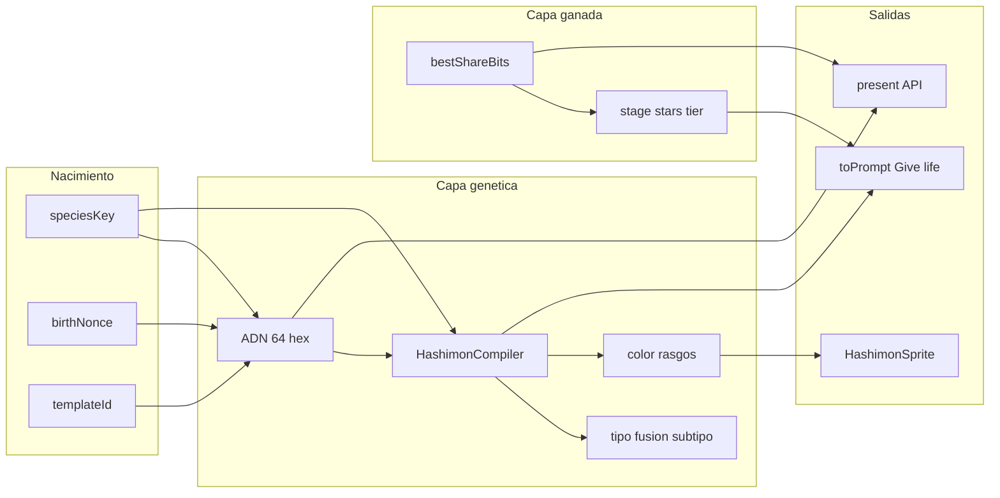

# Hashimon — Generación, ADN, tipos y prompts

Paper técnico de referencia: cómo nace un Hashimon, cómo se determina su tipo elemental (fuego, metal, etc.), cómo se construye el prompt de imagen y qué es genético vs ganado por minería.

> ⚠️ **Aviso de obsolescencia (2026-08-20):** este documento describe, en varias secciones, un cliente `game/Content/*.js` que **ya no existe en este repo**, y una lista de **13 tipos elementales** (con Robot/Plasma/Plant como fusiones) que fue reemplazada por el árbol canónico de **16 tipos** (índice hex 0-F). El sistema vigente hoy es `encubation-website/src/lib/compiler.ts` + su puerto Lua, y la fórmula de ADN Genesis cambió (ya no usa `templateId:birthNonce`). Para el estado actual de tipos, arquetipos y fórmula de ADN, usa [`ADN_PROPIEDAD_TEORIA_DE_JUEGO.md`](./ADN_PROPIEDAD_TEORIA_DE_JUEGO.md) como fuente de verdad — este archivo queda como referencia histórica del diseño del compilador y del sistema de prompts, que en buena parte sigue siendo conceptualmente válido.

**Estado:** documentación del sistema actual  
**Audiencia:** backend, frontend `game/`, integración 3D Luanti  
**Última revisión:** 2026-08-10 — **secciones 3, 5 y 10.1 desactualizadas, ver aviso arriba**

Documentos relacionados: [ADN y evolución (guía)](./HASHIMON_ADN_Y_EVOLUCION.md) · [PoW bound mode](./POW_SPEC.md) · [White Paper v2](./Hashimon_white_paper_2_V1.md)

---

## 1. Resumen ejecutivo

Un Hashimon tiene **dos capas de identidad** que no deben confundirse:

| Capa | Fuente | Qué define |
|------|--------|------------|
| **Genética** | `ADN = SHA256(templateId:birthNonce:speciesKey)` + catálogo de especie | Tipo (`fuego`, `metal`…), subtipo, color, rasgos visuales, stats del compilador |
| **Ganada (PoW)** | Minería verificada (`bestShareBits`) | Stage / stars / tier, escala de combate, madurez del prompt, intensidad del aura |

El **prompt de imagen no se guarda en base de datos**. Se **computa on-demand** con `HashimonPrompt.toPrompt()` a partir del compilador + tier ganado. El jugador es el renderer (copia el prompt en **Give life** y lo usa en su IA favorita).

**Flujos principales:**

| Modo | Dónde nace | Quién genera `birthNonce` |
|------|------------|---------------------------|
| **Online** | `POST /hashimons` → [`api/src/domain/hashimons.ts`](../api/src/domain/hashimons.ts) | Servidor (`randomBytes(8)`) |
| **Offline** | `HashimonSystem.createInstance()` → [`game/Content/hashimonSystem.js`](../game/Content/hashimonSystem.js) | Cliente (encuentros) o catálogo |
| **3D Luanti** | Sync roster vía `hashimon_core` HTTP | Servidor (misma fila PostgreSQL) |

**Qué persiste en PostgreSQL:** identidad + biografía PoW. **Qué no:** tipo, color, prompt, stats de combate escalados — todo derivado en cliente con el compilador.



---

## 2. Nacimiento y emisión

### 2.1 Online — servidor posee el nacimiento [repo `api/`]

El cliente **solicita** una especie; el servidor **decide** la identidad individual.

1. Cliente: `POST /hashimons` con `{ speciesKey, provenance?, name? }` ([`game/Content/hashimonApi.js`](../game/Content/hashimonApi.js) → `emitHashimon()`).
2. Servidor: `emit()` valida la especie en [`api/src/data/species.ts`](../api/src/data/species.ts).
3. Genera `birthNonce = randomBytes(8).toString("hex")`.
4. Deriva `dna = Dna.derive(templateId, birthNonce, speciesKey)`.
5. Inserta fila en `hashimons`; `dna` es **UNIQUE** (reintenta si colisión).

```101:117:api/src/domain/hashimons.ts
export async function emit(input: {
  ownerId: string;
  speciesKey: string;
  templateId?: string;
  provenance?: Provenance;
  name?: string;
}): Promise<HashimonRow> {
  const species = Hashimons[input.speciesKey];
  if (!species) {
    throw new Error(`unknown species: ${input.speciesKey}`);
  }
  const templateId = input.templateId ?? species.templateId;
  const provenance = input.provenance ?? "wild";

  for (let attempt = 0; attempt < 5; attempt++) {
    const birthNonce = randomBytes(8).toString("hex");
    const dna = Dna.derive(templateId, birthNonce, input.speciesKey);
```

**Reglas de emisión:**

- `provenance: "starter"` — una sola emisión genesis por jugador (`countStarterEmissions`).
- Especies `genesis_*` — elección de **elemento puro**; el individuo es único por el nonce del servidor.
- Anti-grind: el cliente **no puede** buscar un ADN “perfecto” antes de nacer.

### 2.2 Offline — cliente `game/` [repo]

- `HashimonSystem.createInstance(speciesKey, overrides)` construye la instancia runtime.
- Tras crear: `hashimon.dna = HashimonDNA.derive(templateId, birthNonce, speciesKey)`.
- **Salvajes:** `HashimonEncounters.rollWild(zoneId)` elige tipo por zona → especie con `zones` → `birthNonce` único (`uniqueNonce()`).

### 2.3 Esquema PostgreSQL — solo identidad + PoW

[`api/src/db/schema.sql`](../api/src/db/schema.sql):

| Columna | Rol |
|---------|-----|
| `dna` | Hash único (64 hex) |
| `species_key` | Clave de catálogo |
| `template_id` | Plantilla de nacimiento |
| `birth_nonce` | Nonce de nacimiento |
| `provenance` | `wild` \| `starter` |
| `best_share_bits` | Mejor share (progresión) |
| `best_share_hash`, `best_share_nonce`, `extranonce2` | Registro PoW |
| `valid_shares`, `total_hashes`, `found_block` | Biografía de trabajo |

**No almacenado:** tipo elemental, color, subtipo, prompt, stats escalados. Comentario explícito en schema: *“Stats and look are NOT stored: they are derived from dna + pow by the Caos Core.”*

### 2.4 Vista API `present()`

[`present()`](../api/src/domain/hashimons.ts) devuelve identidad + progresión derivada + bloque `pow` + `verified` (recomputación del share almacenado).

---

## 3. Fórmula del ADN y mapa de posiciones

### 3.1 Fórmula

```
ADN = SHA-256( templateId : birthNonce : speciesKey )  →  64 caracteres hex minúsculas
```

Implementación idéntica en cliente y servidor:

- Cliente: [`game/Content/hashimonDNA.js`](../game/Content/hashimonDNA.js) — `derive()`
- Servidor: [`api/src/core/dna.ts`](../api/src/core/dna.ts) — `Dna.derive()`

Los nibbles se indexan desde **1** (convención white paper): `[1]` = primer dígito hex, `[64]` = último.

### 3.2 Métodos de lectura del ADN

| Método | Uso en compilador |
|--------|-------------------|
| `at(dna, pos)` | Nibble 0–15 en posición |
| `range(dna, start, len, min, max)` | Valor continuo en ventana |
| `pick(dna, start, len, pool)` | Elegir de lista acotada |
| `modulo(dna, pos, mod)` | Paridad / índice en pool |
| `sin` / `cos` / `sinUnit` | Saturación, luminosidad, acento (distribución no uniforme) |
| `isEven(dna, pos)` | Dual-tipo sí/no |

### 3.3 Mapa de posiciones (resumen)

| Posiciones | Determina | Método |
|------------|-----------|--------|
| `[1]`–`[2]` | Tipo primario (solo si especie no fija tipo) | rango / pick |
| `[3]` | Mono vs dual-tipo | paridad |
| `[4]` | Umbral dual-tipo | rango |
| `[5]`–`[6]` | Tipo secundario | rango / pick |
| `[7]` | Subtipo | módulo |
| `[9]` | Banda de matiz dentro del tipo | módulo |
| `[10]`–`[13]` | Matiz exacto (65 536 valores) | rango |
| `[14]`–`[16]` | Saturación | seno |
| `[17]`–`[19]` | Luminosidad | seno |
| `[20]`–`[22]` | Esquema de acento | coseno |
| `[23]`–`[24]` | Saturación del acento | seno |
| `[25]`–`[31]` | Estrellas innatas ADN (no usadas en rank actual) | umbral encadenado |
| `[35]`–`[36]` | Arquetipo (si especie no lo fija) | pick |
| `[37]`–`[52]` | Build, postura, tamaño, ojos, marcas, temperamento, material, rasgo | pick |
| `[1]`, `[2]`, `[3]`, `[63]`, `[64]` | Stats canónicos del compilador | posicional |

**Reservados:** `[8]`, `[32]`–`[34]`, `[53]`–`[62]` — 56 bits libres para rasgos futuros sin invalidar criaturas existentes.

Detalle ampliado para jugadores: [HASHIMON_ADN_Y_EVOLUCION.md §3](./HASHIMON_ADN_Y_EVOLUCION.md).

---

## 4. Catálogo de especies (`speciesKey`)

**Especie = identidad compartida** de la línea evolutiva / rama. Fija lo reconocible; el ADN individualiza color y rasgos dentro de esa identidad.

| Campo catálogo | Rol |
|----------------|-----|
| `type` / `type2` | Elemento(s) primarios (máx. 2) |
| `archetype` | Silueta compartida (canine, lion, ursine…) |
| `baseHp`, `baseStats` | Base de combate antes de escalar por stage |
| `templateId` | Entrada a la fórmula del ADN |
| `zones` | Dónde aparece en encuentros salvajes (cliente) |

**Tres copias del catálogo:**

| Ubicación | Contenido |
|-----------|-----------|
| [`game/Content/hashimons.js`](../game/Content/hashimons.js) | Catálogo completo: sprites, moves, `spriteStages` |
| [`api/src/data/species.ts`](../api/src/data/species.ts) | Subset emisionable por servidor |
| [`3d-world/mods/hashimon_entities/species.json`](../3d-world/mods/hashimon_entities/species.json) | Export 3D vía `scripts/export-species-for-voxel.cjs` |

### 4.1 Ejemplos concretos

| speciesKey | Nombre | Tipo | templateId | Notas |
|------------|--------|------|------------|-------|
| `genesis_fuego` | Ember Genesis | `fuego` · Pure | `template_genesis_fuego` | Starter servidor |
| `genesis_metal` | — | — | — | No existe; metal vía especies como `s002` |
| `s002` | Bacon Brigade | `metal` | `template_metal_001` | Salvaje / calle |
| `solarCub` | Solar Cub | `fuego` | `template_solar_001` | Zona `kitchen` |
| `v001` | Call Me Kale | `tierra` + `agua` | `template_plant_001` | Fusión **Plant** |
| `s001` | Hashimon | `pixel` | `template_genesis_001` | Starter offline actual |

---

## 5. Tipos elementales (fuego, metal, agua…)

Definición canónica: [`game/Content/hashimonTypes.js`](../game/Content/hashimonTypes.js).

### 5.1 Los 13 tipos primarios

Keys en **español** (white paper); `name` en inglés para UI.

| Key | UI (EN) | Subtipos (ejemplos) |
|-----|---------|---------------------|
| `fuego` | Fire | Pure, Volcano, Ember |
| `agua` | Water | Pure, Vapor, Ice, Tide |
| `onda` | Wave | Pure, Light, Shadow, Vibration, Sound |
| `electrico` | Electric | Pure, Plus, Minus, Arc |
| `tierra` | Earth | Pure, Crystal, Mud, Fossil |
| `aire` | Air | Pure, Storm, Gale, Mist |
| `astro` | Astro | Pure, Star, Nova, Chaos |
| `pixel` | Pixel | Pure, Glitch, Block, Crypto |
| `sueno` | Dream | Pure, Nightmare, Specter |
| `magia` | Magic | Pure, Psychic, Monster, Fae |
| `metal` | Metal | Pure, Alloy, Magneto, Forge |
| `hongo` | Fungus | Pure, Spore, Mycelium, Rot |
| `mental` | Mind | Pure, Psionic, Oracle, Void |

**Robot, Plasma y Plant** existen solo como **fusiones dual-type** — no entran en el pool aleatorio de ADN para tipo primario.

### 5.2 Reglas de asignación (`compileTypes`)

```93:120:game/Content/hashimonCompiler.js
  compileTypes(dna, species) {
    const primaryKeys = window.HashimonPrimaryKeys || Object.keys(HashimonTypes);
    let primary, secondary;

    if (species && species.type) {
      primary = HashimonTypeUtils.normalizeTypeKey(species.type);
      secondary = species.type2 ? HashimonTypeUtils.normalizeTypeKey(species.type2) : null;
    } else {
      primary = HashimonDNA.pick(dna, 1, 2, primaryKeys);
      const wantsDual = !HashimonDNA.isEven(dna, 3) && HashimonDNA.at(dna, 4) >= 6;
      secondary = wantsDual
        ? HashimonDNA.pick(dna, 5, 2, primaryKeys.filter(k => k !== primary))
        : null;
    }

    const fusionDef = secondary ? HashimonTypeUtils.resolveFusion(primary, secondary) : null;
    // ...
    subtype: subtypePool[HashimonDNA.modulo(dna, 7, subtypePool.length)],
    fusion: fusionDef ? fusionDef.name : null,
```

1. **Especie con `type`** → gana el catálogo (genesis elige elemento; salvajes heredan el de la especie).
2. **Sin especie** → tipo primario/secundario desde ADN `[1]`–`[6]`.
3. **Subtipo** → siempre individual: ADN `[7]` módulo pool (Pure, Volcano, Alloy…).
4. **Fusión** → si hay `type2`, `HashimonFusionMap["prim|sec"]` (ej. `agua|tierra` → **Plant**).

### 5.3 Ejemplo: fuego vs metal (pools visuales)

| Tipo | Bandas matiz (`hues`) | Material (ej.) | Rasgo (ej.) | Aura |
|------|----------------------|----------------|-------------|------|
| **fuego** | 8–42° | piel agrietada con brasas | melena de llama | calor que distorsiona el aire |
| **metal** | 200–220° | placas de acero pulido | juntas expuestas | limaduras flotando en líneas de campo |

El compilador elige material/feature concretos vía `pick(dna, 49/51, …)` sobre los pools del tipo o de la fusión.

### 5.4 Ejemplo: dual-type → Plant

Especie `v001`: `type: "tierra"`, `type2: "agua"`.

Fusión en mapa: `"agua|tierra"` → nombre **Plant**, subtipos Verdant/Bloom/Rootbound, flavor y pools visuales propios ([`hashimonTypes.js`](../game/Content/hashimonTypes.js) ~212–220).

---

## 6. El compilador (`HashimonCompiler`)

Módulo: [`game/Content/hashimonCompiler.js`](../game/Content/hashimonCompiler.js).

Traduce **ADN + especie** en fenotipo determinista. Mismo ADN + misma especie → mismo resultado siempre.

| Función | Entrada | Salida |
|---------|---------|--------|
| `compileTypes` | ADN [1]–[7], species | primary, secondary, fusion, subtype |
| `compileColor` | ADN [9]–[24], types | base/accent hex + HSL + relation |
| `compileLook` | ADN [35]–[52], species.archetype | ojos, marcas, material, feature, aura |
| `compileStats` | ADN [1], [2], [3], [63], [64] | ataque, defensa, velocidad, hp, suerte |
| `compile()` | instancia hashimon | objeto unificado; **stars** desde PoW, no ADN |

**Color:** la unicidad visual vive aquí — ventana de 4 nibbles para matiz (65 536 valores) + seno/coseno para saturación y acento.

**Nombre:** [`game/Content/hashimonNames.js`](../game/Content/hashimonNames.js) genera nickname determinista desde ADN si el jugador no asigna `name`.

**Estrellas en UI del compilador:** `floor(bestShareBits / 4)` — capa **ganada**, no `compileStars(dna)` (estrellas innatas ADN reservadas para uso futuro).

---

## 7. Prompts de imagen (`HashimonPrompt`)

Módulo: [`game/Content/hashimonPrompt.js`](../game/Content/hashimonPrompt.js).

**No hay columna `prompt` en PostgreSQL.** El texto se genera al vuelo.

### 7.1 Filosofía

- **Identidad estable:** especie, tipo y color exacto no cambian al nacer.
- **Madurez evolutiva:** el bloque `maturityBlock` avanza con stars/stage (hatchling → monster ~rank 15).
- **Jugador = renderer:** V1 no tiene pipeline de arte propio; **Give life** copia el prompt para IA externa.

### 7.2 Estructura de `toPrompt(hashimon, styleKey)`

Bloques de prosa en inglés (destino: modelos de imagen):

| Sección | Contenido |
|---------|-----------|
| SPECIES & BODY | Arquetipo, postura, build, tamaño + **maturityBlock** |
| ELEMENT | typeLine, typeFlavor, material, feature, aura |
| COLOR | Hex/HSL exactos — *“exact, do not substitute”* |
| TRAITS | Ojos, marcas, temperamento, rarity stars |
| PROOF OF WORK | `powFlavor` según leading zeros del mejor hash |
| STYLE | `creature` \| `pixel` \| `card` |
| Footer | ADN truncado · forma · N★ |

```127:155:game/Content/hashimonPrompt.js
    return [
`Generate an image of "${c.name}", a creature called a Hashimon.`,
``,
`SPECIES & BODY`,
`${this.article(look.archetype) === "an" ? "An" : "A"} ${look.archetype}, ${look.posture}, ${look.build}, ${look.size}.`,
`${maturity.text}`,
``,
`ELEMENT`,
`It is ${this.article(this.typeLine(types))} ${this.typeLine(types)}. ${this.typeFlavor(types)} Its body shows ${look.material}, and it stands out for ${look.feature}. Around it: ${look.aura}.`,
// ... COLOR, TRAITS, PROOF OF WORK, STYLE ...
`— DNA ${c.dna.slice(0, 16)}… · ${maturity.form} · ${c.stars}★`,
    ].join("\n");
```

### 7.3 Estilos

| styleKey | Uso |
|----------|-----|
| `creature` | Ilustración fantasy cuerpo completo (default) |
| `pixel` | Sprite 32×32, paleta limitada |
| `card` | Arte tipo carta coleccionable |

### 7.4 Value sheet JSON

`toValues(hashimon)` — JSON con Name, DNA, Stars, Type, Subtype, Stage, Look, Stats, PoW. Alternativa al prompt en prosa.

### 7.5 Previews por tier

`toPromptAtTier(hashimon, tier, styleKey)` — clona con `bestShareBits` sintético para slots de álbum.

### 7.6 UI

**Mi colección → Give life** → copiar prompt o value sheet ([`game/HashimonCollection.js`](../game/HashimonCollection.js)).

---

## 8. PoW, evolución y combate

Spec byte-exact: [POW_SPEC.md](./POW_SPEC.md).

### 8.1 Relación ADN ↔ minería

| Concepto | Rol |
|----------|-----|
| ADN | Contexto **fijo** del job de minería; no cambia al encontrar shares |
| `extranonce1` | Primeros 8 hex del ADN |
| `extranonce2` | Contador de búsqueda del cliente (persiste) |
| `nonce` | Variable por intento de hash |

**Bound (servidor MVP):**

```
hash = doubleSha256( "${dna}:${extranonce1}:${extranonce2}:${nonce}" )
```

**Legacy (cliente local):**

```
hash = doubleSha256( "${dna}:${extranonce2}" )
```

### 8.2 Progresión

```
tier = stars = stage = min( floor(bestShareBits / 4), 33 )
```

Cada estrella ≈ un nibble hex más de ceros a la izquierda (~16× más raro).

### 8.3 Combate

`HashimonSystem.applyStageScaling()` — **+18% por stage** sobre `baseHp` y `baseStats` de la especie (`HashimonConfig.statGrowthPerStage = 0.18`).

### 8.4 Verificación

Servidor recomputa share en `present()` → `verified: true | null | false`.

### 8.5 “Evolución” ≠ cambio de especie

No hay cadena Bulbasaur → Ivysaur. **Mismo `speciesKey` y mismo ADN siempre.** Lo que sube es madurez visual, stats escalados y ornamento del prompt — no el elemento (`fuego` sigue siendo `fuego`).

---

## 9. Integración 3D Luanti [repo `3d-world/`]

Mod: [`hashimon_entities`](../3d-world/mods/hashimon_entities/).

| Dato API | Uso en mundo 3D |
|----------|-----------------|
| `speciesKey` | Tinte elemental desde `species.json` |
| `stage` / `tier` | Escala del companion (~0.6–2.5) |
| `dna` | Índice de variante de textura lobo (bytes 1–8) |
| `name` | Nametag con ★stage |

**No recompila prompt** en Luanti. La representación 3D es lobo Animalia/Creatura (o sprite fallback), no imagen generada por IA.

Sync: `hashimon_core` HTTP → roster del jugador → spawn en grid alrededor del player.

---

## 10. Genesis, salvajes y gaps actuales

### 10.1 Genesis elemental (servidor)

Cinco starters en [`api/src/data/species.ts`](../api/src/data/species.ts):

| speciesKey | Tipo | templateId |
|------------|------|------------|
| `genesis_fuego` | fuego | `template_genesis_fuego` |
| `genesis_agua` | agua | `template_genesis_agua` |
| `genesis_aire` | aire | `template_genesis_aire` |
| `genesis_tierra` | tierra | `template_genesis_tierra` |
| `genesis_electrico` | electrico | `template_genesis_electrico` |

### 10.2 Gaps documentados

| Gap | Detalle |
|-----|---------|
| Cliente offline starter | `PlayerState.seedStarter()` aún crea `s001` (pixel), no picker `genesis_*` |
| Catálogo cliente | `genesis_*` no están en `game/Content/hashimons.js` — `mapServerToLocal()` fallaría sin extender catálogo |
| Export 3D | `species.json` no incluye `genesis_*` hasta exportar desde cliente |
| PoW dual-mode | Minería local legacy vs servidor bound — ver [HASHIMON-RABBIT-POW.md](./HASHIMON-RABBIT-POW.md) |
| Encuentros salvajes online | Semilla de mundo servidor para *qué* especie aparece — hook Caos Engine futuro |

---

## 11. Referencia rápida

### Tabla genético vs ganado

| Propiedad | Genético (ADN + especie) | Ganado (PoW) |
|-----------|--------------------------|--------------|
| ADN | Sí | No |
| Tipo / fusión | Sí (especie; ADN fallback) | No |
| Subtipo, colores, rasgos | Sí | No |
| Nickname (default) | Sí | No |
| Stats compilador | Sí | No |
| Stars / stage / tier | No | Sí |
| Stats combate escalados | base especie | Sí (+18%/stage) |
| Madurez prompt / sprite | look fijo | Sí (maturity block) |
| Aura PoW en prompt | No | Sí |

### Endpoints API

| Método | Ruta | Rol |
|--------|------|-----|
| POST | `/hashimons` | Emitir criatura |
| GET | `/hashimons/:id/job` | Job de minería bound |
| POST | `/hashimons/:id/shares` | Enviar share válido |

### Comandos / UI

| Acción | Dónde |
|--------|-------|
| Give life (prompt) | Colección browser |
| Mine | Laboratorio / botón minería |
| `/hashimon sync` | Luanti — roster 3D |
| `/hashimon starter` | Emisión genesis (API) |

### Archivos clave

| Archivo | Rol |
|---------|-----|
| `game/Content/hashimonDNA.js` | Derivar y leer ADN |
| `game/Content/hashimonCompiler.js` | ADN → fenotipo |
| `game/Content/hashimonTypes.js` | 13 tipos + fusiones |
| `game/Content/hashimonPrompt.js` | Prompt + value sheet |
| `game/Content/hashimons.js` | Catálogo cliente |
| `game/Content/hashimonSystem.js` | Instancias, scaling, tier |
| `api/src/domain/hashimons.ts` | Emisión servidor |
| `api/src/data/species.ts` | Catálogo emisionable |
| `api/src/core/pow.ts` | Verificación shares |

---

## 12. Referencias

- [HASHIMON_ADN_Y_EVOLUCION.md](./HASHIMON_ADN_Y_EVOLUCION.md) — guía jugador/dev (ADN, Give life, genesis)
- [POW_SPEC.md](./POW_SPEC.md) — fórmulas PoW bound/legacy
- [HASHIMON-RABBIT-POW.md](./HASHIMON-RABBIT-POW.md) — integración minería
- [Hashimon_white_paper_2_V1.md](./Hashimon_white_paper_2_V1.md) — diseño original Caos Core
- [LLM_INFERENCE_ARCHITECTURE.md](./LLM_INFERENCE_ARCHITECTURE.md) — NPCs futuros (no afectan generación Hashimon)
