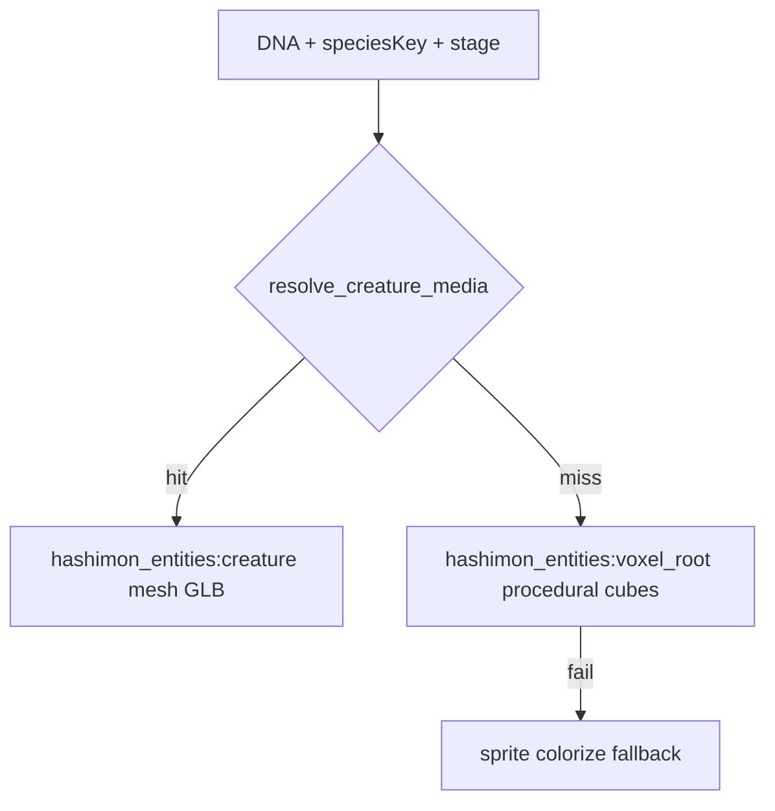
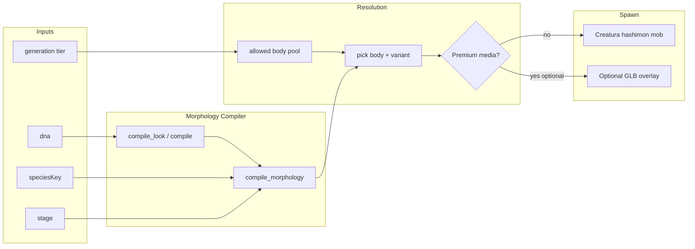

# Hashimon Morphology Compiler — Plan técnico

Documento de diseño e implementación MVP. Código en `3d-world/mods/hashimon_core/morphology.lua` y `3d-world/mods/hashimon_bodies/`.

---

## 1. Executive Summary

Hashimon hoy resuelve el 3D en Luanti con una cadena de tres niveles ([`entities.lua`](3d-world/mods/hashimon_entities/entities.lua)):



Esto funciona para pruebas (Oso Pedro / Premium GLB) pero **no escala**: un `.glb` por individuo no da animación de caminata, follow es manual, escala es frágil, y la diversidad visual no crece sin almacenar assets nuevos.

**Propuesta:** introducir un **Hashimon Morphology Compiler** entre la genética ya existente (`compile()` / `compile_look()`) y el spawn 3D. Produce un **descriptor de fenotipo** (body family, skeleton, variant, attachments, colors, capabilities) que instancia un **cuerpo canónico reutilizable** — no un archivo 3D nuevo.

Principio rector:

```text
IDENTIDAD ÚNICA (DNA + speciesKey + provenance)
≠
MODELO 3D ÚNICO (Premium opcional)
```

Jerarquía conceptual a respetar:

```text
16 FUNDAMENTAL TYPES
  → SPECIES (speciesKey / línea evolutiva)
    → BREEDS / VARIANTS (subType, body variant, dual-family)
      → INDIVIDUAL DNA (color, attachments, proportions)
        → LIFE HISTORY (stage/PoW, owner, shares, generation)
```

---

## 2. Current State Audit

### 2.1 Compiladores existentes

| Runtime | Archivo | Qué compila hoy |
|---------|---------|-----------------|
| Portal | [`encubation-website/src/lib/compiler.ts`](encubation-website/src/lib/compiler.ts) | Tipo, dual-type, subType, arquetipo, color, 8 rasgos, nativeStars, stats×stage |
| Luanti | [`3d-world/mods/hashimon_core/dna_compiler.lua`](3d-world/mods/hashimon_core/dna_compiler.lua) | Subconjunto visual: hue, ramp 5 tonos, build, size, markings, material |
| API | [`api/src/core/dna.ts`](api/src/core/dna.ts) + `present()` | Emisión, PoW, recomputación on-read |

**Brecha crítica:** el compilador TS define **16 arquetipos** (canine, avian, reptilian…) pero Luanti **solo renderiza canine/egg** en [`voxel_body.lua`](3d-world/mods/hashimon_entities/voxel_body.lua). El arquetipo no llega al mundo 3D.

### 2.2 Render 3D actual

| Tier | Implementación | Movimiento | Animación |
|------|----------------|------------|-----------|
| Premium GLB | [`media.lua`](3d-world/mods/hashimon_core/media.lua) + `hashimon_entities:creature` | `step_follow_owner` (reciente) | Ninguna (pose estática) |
| Voxel procedural | `voxel_root` + attached cubes | Follow + mount (stage≥10) | Ninguna |
| Sprite | `creature` fallback | Follow | Ninguna |
| Wolf companion | [`companion.lua`](3d-world/mods/hashimon_entities/companion.lua) Creatura | `tamed_follow_owner` | stand/walk/run/sit |

**Lección de Oso Pedro:** escalar en Blender o vía `visual_size` no sustituye skeleton + walk cycle. El MVP debe anclarse en **Creatura mobs con animaciones reales**.

### 2.3 Taxonomía vs código

- **16 tipos canónicos** documentados en [`api/docs/ADN_PROPIEDAD_TEORIA_DE_JUEGO.md`](api/docs/ADN_PROPIEDAD_TEORIA_DE_JUEGO.md) — **desincronizados** con `compiler.ts` (`robot`/`plasma` en lugar de `espíritu`/`vacío`).
- **Rutas de síntesis** (Plant, Magic, Void…) existen en docs históricos, **no en código activo**.
- **Dual-type:** DNA `[3]–[6]` en TS; `species.type2` en JSON ignorado.
- **Generación/linaje:** concepto documental; **sin campo DB** ni reglas morfológicas.

### 2.4 Anti-reroll ya presente

- `birthNonce` generado por servidor en [`api/src/domain/hashimons.ts`](api/src/domain/hashimons.ts).
- Genesis: una sola vez por jugador (`provenance = starter`).
- DNA `UNIQUE` en DB; cliente no puede enviar DNA arbitrario.
- Look derivado, no almacenado — cambiar reglas de compilación es backward-compatible si los nibbles activos no cambian.

---

## 3. Inventory of Existing Mobs

### 3.1 En el repo Hashimon (`3d-world/mods/`)

| Mod | Entidades | Mesh | Framework | Follow | Anims | Licencia |
|-----|-----------|------|-----------|--------|-------|----------|
| `hashimon_entities` | creature, voxel_root, blast_orb, companion | GLB externo / cubes / wolf.b3d | Custom + Creatura opt. | Sí (custom) | Wolf only | Sin LICENSE |
| `glowcap_sprout` | glowcap_sprout:creature | glowcap_sprout.glb | Custom | No | 0 | Sin LICENSE |
| `neon_dream_bat` | neon_dream_bat:creature | neon_dream_bat.glb | Custom | No | 0 | Sin LICENSE |
| `hashimon_meshy_integration` | meshy_* | *.glb | Custom | No | 0 | Sin LICENSE |
| devtest `gltf` | 14+ test entities | .gltf/.glb | Engine test | No | spider, frog, skin | CC0/CC-BY |

### 3.2 Instalados en Hashiworld (`~/Library/Application Support/minetest/mods/`)

#### Animalia (MIT) — **Creatura**, 17 mobs `.b3d`

| Entity | Mesh | Animaciones típicas | AI relevante |
|--------|------|---------------------|--------------|
| `animalia:wolf` | animalia_wolf.b3d | stand, walk, run, sit | follow, attack, breed, wander |
| `animalia:fox` | animalia_fox.b3d | stand, walk, run | wander, flee |
| `animalia:horse` | animalia_horse.b3d | stand, walk, run, rear | mount-capable patterns |
| `animalia:grizzly_bear` | animalia_bear.b3d | stand, walk | wander |
| `animalia:bat` | animalia_bat.b3d | fly cycles | aerial |
| `animalia:owl` | animalia_owl.b3d | stand, fly | aerial |
| `animalia:song_bird` | animalia_bird.b3d | stand, fly | aerial |
| `animalia:frog` | multi-mesh | hop | amphibian |
| `animalia:tropical_fish` | multi-mesh | swim | aquatic |
| cat, chicken, cow, pig, rat, reindeer, sheep, turkey, opossum | respectivos .b3d | walk/stand variants | domestic/wild |

#### Draconis — **Creatura**, dragones `.b3d`

| Entity | Mesh | Animaciones | Capabilities |
|--------|------|-------------|--------------|
| `draconis:fire_dragon` | draconis_fire_dragon.b3d | stand, walk, fly, hover, attack, sleep, death | fly, mount, breath |
| `draconis:ice_dragon` | draconis_ice_dragon.b3d | idem | fly, mount |
| `draconis:jungle_wyvern` | draconis_jungle_wyvern.b3d | walk, fly subset | fly (más pequeño que dragon) |

#### dmobs — **mobs API** (Mobs Redo), ~20+ mobs `.b3d`

Incluye: badger, butterfly, elephant, fox, golem, golem_friendly, hedgehog, ogre, orc, owl, panda, pig, skeleton, tortoise, **treeman**, wasps, whale; subcarpeta **dragons/** (wyvern, water_dragon, great_dragon…).

#### Otros

- `marinaramobs`: delfín, pulpo, medusa, etc. (API propia, acuático).
- `mobs`: solo API MIT, sin criaturas.
- `mobkit`, `mob_core`, `folks`: frameworks/NPC, no catálogo Hashimon-ready.
- `haxel_dragon`: wrapper de spawn Draconis.

### 3.3 Lo que NO existe localmente

No hay lion, boar, raptor, scorpion, shark, snake, slime, treant premium, humanoid rig dedicado **fuera de dmobs orc/skeleton/golem**. La clasificación debe salir de lo encontrado, no de una lista ideal.

---

## 4. Framework / Mod / License Matrix

| Framework | Mods | Licencia | Reutilizable para Hashimon | Notas |
|-----------|------|----------|----------------------------|-------|
| **Creatura** | creatura, animalia, draconis | MIT | **Sí — preferido** | Ya integrado en companion.lua; animaciones .b3d maduras |
| **Custom** | hashimon_entities, Meshy mods | — | Parcial | Follow manual; sin walk en GLB |
| **mobs (Redo API)** | dmobs | dmobs: ver license.txt | Posible fase 2 | API distinta; muchos cuerpos útiles |
| **GLTF engine** | devtest gltf | CC0/CC-BY | Prototipo arácnido | Spider animado; no Creatura |
| **marinaramobs** | marinaramobs | LICENSE propio | Acuático futuro | Menor prioridad MVP |

**Recomendación legal:** priorizar **Animalia + Draconis (MIT)** para producción; dmobs como ampliación documentada con licencia verificada antes de ship.

---

## 5. Proposed Body Families (desde mobs reales)

| Body Family | Skeletons candidatos | Fuente | Prioridad MVP |
|-------------|---------------------|--------|---------------|
| **CANINE** | wolf, fox, badger | Animalia, dmobs | **Alta** |
| **LARGE_QUADRUPED** | bear, horse, elephant, panda | Animalia, dmobs | Media |
| **AVIAN** | owl, song_bird, bat, butterfly | Animalia, dmobs | **Alta** (bat/owl) |
| **DRAGON** | jungle_wyvern, fire_dragon (scaled) | Draconis | Media (wyvern first) |
| **REPTILE** | tortoise, frog | dmobs, Animalia | Baja |
| **ARTHROPOD** | wasp, gltf_spider | dmobs, devtest | Media (spider prototipo) |
| **AQUATIC** | tropical_fish, whale, marinaramobs | Animalia, dmobs | Fase 2 |
| **PLANT** | treeman | dmobs | Fase 2 |
| **HUMANOID** | skeleton, orc, golem | dmobs | G3+ only |
| **ABERRANT** | nyan, flying_pig, dmobs dragons raros | dmobs | G4+ only |

---

## 6. Candidate Skeletons (detalle MVP)

### Tier A — usar en experimento

1. **Wolf** (`animalia_wolf.b3d`) — 4 texturas, walk/run probado en [`companion.lua`](3d-world/mods/hashimon_entities/companion.lua).
2. **Bat** (`animalia_bat.b3d`) — vuela; útil para Air/Spirit families.
3. **Jungle Wyvern** (`draconis_jungle_wyvern.b3d`) — dragón mediano con fly/walk.

### Tier B — expansión rápida post-MVP

Fox, bear, owl, wasp, tortoise, horse (mount semantics).

### Tier C — no MVP

Fire/ice dragon adulto (visual_size 20, AI agresiva), orc/golem, whale.

---

## 7. Animation Capability Matrix

| Skeleton | idle | walk | run | attack | jump | fly | swim | death | sit |
|----------|------|------|-----|--------|------|-----|------|-------|-----|
| wolf | ✓ | ✓ | ✓ | via Creatura | stepheight | — | — | Creatura | ✓ |
| bat/owl | ✓ | — | — | — | — | ✓ | — | — | — |
| jungle_wyvern | ✓ | ✓ | — | ✓ | — | ✓ | — | ✓ | — |
| gltf_spider | ✓ | ✓ | — | — | — | — | — | — | — |
| voxel canine | — | slide | slide | blast orb | — | — | — | — | — |
| Premium GLB | pose | ✗ | ✗ | ✗ | ✗ | ✗ | ✗ | ✗ | ✗ |

**Conclusión:** el criterio "movimiento no negociable" exige **Creatura `.b3d`** como canonical form, no GLB estático.

---

## 8. Hashimon Body Interface (propuesta)

Nuevo módulo propuesto: [`3d-world/mods/hashimon_bodies/`](3d-world/mods/hashimon_bodies/) (o subcarpeta en `hashimon_core`).

```lua
-- Conceptual API — adaptado a Creatura como backend principal
hashimon.register_body({
  id = "canine_wolf",
  family = "canine",
  framework = "creatura",  -- "creatura" | "mobs" | "custom"

  mesh = "animalia_wolf.b3d",
  textures = { "animalia_wolf_1.png", ... },  -- o función(dna) -> index
  visual_size = { x = 10, y = 10 },           -- base; stage scales

  animations = {
    idle = { range = {1, 60}, speed = 20, loop = true },
    walk = { range = {70, 89}, speed = 30, loop = true },
    run  = { range = {100, 119}, speed = 40, loop = true },
  },

  slots = { "head", "back", "tail_root" },  -- attach points (child entities)
  capabilities = { walk = true, run = true, fly = false, swim = false, mount = false },

  ai = {
    follow_owner = true,
    utility = { "tamed_follow_owner", "tamed_stay" },  -- Creatura stack refs
  },

  -- Morfología: qué puede variar sin cambiar skeleton
  supports = {
    texture_variant = true,   -- 1-4 wolf skins via DNA
    colorize = true,          -- ^[colorize:#...] per TYPE_COLORS
    visual_size = true,       -- build/size/stage
    attachments = { "horn", "tail_flame", "aura_orb" },
  },
})
```

**Spawn flow:**



Hashimon gameplay code (`attack`, `mount`, roster) habla con **`hashimon.spawn_morph_creature(pos, creature, owner)`** — no con `animalia:wolf` directamente.

---

## 9. DNA → Morphology Pipeline

```text
1. compile(dna, speciesKey, stage)     → HashimonLook (TS) / subset (Lua)
2. compile_morphology(look, meta)      → MorphologyDescriptor
   meta = { generation, lineageDepth, synthesisPath?, dualFamily?, mutationFlags? }
3. resolve_body_pool(species, type, type2, generation, subType)
4. pick_body(dna reserved bits + archetype + pool)
5. apply_phenotype(body, look, stage)
   - texture index from DNA
   - colorize from element palette + compile_look
   - visual_size from build/size/stage
   - attachments from signatureFeature + reserved bits
6. spawn via body adapter (Creatura mob factory)
```

**Paridad TS ↔ Lua:** extender [`dna_compiler.lua`](3d-world/mods/hashimon_core/dna_compiler.lua) o generar JSON de morfología desde portal/API y enviarlo al cliente — evitar divergencia manual.

---

## 10. Genetic Mutation Layers

| Nivel | Rasgos | Realismo Luanti | Fuente DNA |
|-------|--------|-----------------|------------|
| **L1 Superficial** | color, accent, eyes (texture mod), markings (overlay), material bump, glow/aura, size global | **Alto** — colorize, visual_size, particles | `[9]–[24]`, `[43]`, `[45]`, `[49]`, stage |
| **L2 Modular** | horns, tail FX, wings (attached cube/mesh), spikes, crystals, back ornament | **Medio** — `set_attach` child entities (patrón voxel_body) | `[51]` signature + reservados `[53]–[62]` |
| **L3 Proporcional** | head/body/leg girth | **Medio-bajo** en .b3d (solo global); **alto** en voxel | `[37]` build, `[41]` size — ya usados en voxel |
| **L4 Estructural** | body family change, quadruped↔biped | **Bajo** — requiere otro skeleton; gate por generation | `[35]–[36]` archetype + `[8]` family + generation rules |

**No construir aún:** morph targets universales, skinning custom en runtime, escala por hueso en .b3d.

---

## 11. Generation / Lineage Diversity Triangle

Propuesta de **generation tier** (nuevo metadato derivado, no en DNA hoy):

| Tier | Origen | Pool morfológico | Mutaciones permitidas |
|------|--------|------------------|----------------------|
| **G0 Genesis** | `provenance=starter`, species `genesis_*` | 2–3 families por elemento, subType restringido | L1 only |
| **G1** | 1ª síntesis o offspring documentado | +1 family, L2 attachments comunes | L1–L2 |
| **G2** | dual-type activo, 2ª gen | dual-family pools (Steam, Volcano…) | L1–L2, L3 parcial |
| **G3** | linaje profundo / rare synthesis | humanoid, plant, arthropod raro | L1–L3, L4 limitado |
| **G4+** | Magic/Void/Astro avanzado | aberrant, floating, spectral | L1–L4 acotado |

**Importante:** `generation` debe persistirse (DB o derivarse de `provenance` + historial de síntesis) — **no inferirse solo de stage/PoW**.

---

## 12. Element → Allowed Body Matrix (propuesta inicial)

Solo familias con skeleton real. G0 = Genesis starters.

| Elemento (G0) | allowedBodies G0 | Expande con dual/synth |
|---------------|------------------|------------------------|
| Fire | canine, reptile (tortoise), small_dragon (wyvern scaled) | + avian (Emberwind: fire+air → Spirit path) |
| Water | aquatic (fish), canine, reptile (frog) | + mollusk/aquatic |
| Air | avian (bat, owl), canine | + wyvern |
| Earth | large_quadruped (bear, horse), plant (treeman G2+) | + golem G3 |
| Electric | canine, avian, arthropod (wasp) | + construct |
| Wave | aquatic, avian | Pixel synth path |
| Spirit | canine, avian, bat | floating attachment G2 |
| Void | aberrant attachments, wyvern, humanoid G4 | spectral effects |
| Plant/Fungus | treeman, canine (masked) | — |
| Metal | construct (golem), canine armored attachments | Robot dual-family |
| Pixel | canine + glitch colorize | — |

---

## 13. Dual-Type Morphology Rules

Dual-type **no crea tipos fundamentales nuevos**. Crea **dual-family labels** para pools:

| Dual pair (ejemplo) | Morph family label | Efecto en pool |
|---------------------|-------------------|----------------|
| Fire + Water | Steam | acuático + vapor particles; acota a mammal/acuatic |
| Fire + Earth | Volcano | large_quadruped + glow accents |
| Fire + Electric | Plasma | electric colorize + aura |
| Pixel + Metal | Robot | golem attachments + metallic material |

Implementación: tabla `DUAL_FAMILY_RULES["fuego|agua"] = { label="steam", extraFamilies={...}, fx={...} }` aplicada **después** de resolver tipos primario/secundario.

---

## 14. Pure Synthesis Morphology Rules

Para los 11 tipos no-Genesis (Wave, Astro, Pixel, Dream, Magic, Metal, Fungus, Mental, Plant, Spirit, Void):

- Requieren **ruta de síntesis registrada** (futuro: tabla en API, no reroll).
- Cada ruta desbloquea **sub-pool** dentro del triángulo G1–G4.
- Ejemplo: `Water+Earth → Plant` desbloquea `treeman` skeleton para descendientes con `generation ≥ 1`.

**Estado actual:** implementar reglas como **datos** en JSON/Lua aunque la mecánica de síntesis gameplay aún no exista — permite probar morfología determinista offline.

---

## 15. Stage vs Genetics

| Dimensión | Fuente | Afecta morfología |
|-----------|--------|-------------------|
| **Lineage / generation** | DB / synthesis history | Qué families y mutaciones L4 están permitidas |
| **DNA** | SHA-256 birth | Qué variante dentro del pool |
| **Stage / PoW** | `bestShareBits` | Escala, aura intensity, ornament tier, animation speed multiplier — **no** cambia family |

Reglas stage (ya parcialmente en código):

- `visual_size *= f(stage)` — companion usa base 10; morphology usar factor unificado.
- Egg vs hatched: [`creature_stage < 1`](3d-world/mods/hashimon_entities/voxel_body.lua) → silueta huevo (mantener para canonical form).
- Mount: stage ≥ 10 ([`mount.lua`](3d-world/mods/hashimon_entities/mount.lua)) — solo bodies con `capabilities.mount`.

---

## 16. Species Identity Model

```text
speciesKey = "genesis_fuego" | "electric_canine_001" | ...
  ├── fixed type (Genesis) OR DNA-picked type
  ├── optional bodyFamily override (species table)
  ├── baseStats (portal catalog)
  └── silhouette contract: same species → same bodyFamily + skeleton base

Individual DNA → variant within contract:
  - texture index, color band, markings, attachments, proportions
```

Ejemplo futuro en [`species.json`](3d-world/mods/hashimon_entities/species.json):

```json
"electric_canine_001": {
  "type": "eléctrico",
  "bodyFamily": "canine",
  "skeleton": "canine_wolf",
  "variantPool": ["wolf_1", "wolf_2", "wolf_3", "wolf_4"]
}
```

Ember Genesis (`genesis_fuego`) comparte linaje pero individuos difieren en color/rasgos — **misma silueta canina reconocible**.

---

## 17. Attachment System

Reutilizar patrón probado en [`voxel_body.lua`](3d-world/mods/hashimon_entities/voxel_body.lua): child entities con `set_attach`.

| Attachment | Implementación MVP | DNA driver |
|------------|-------------------|------------|
| Horns | cube/mesh child en head slot | `[51]` crown/horns |
| Tail flame | particle + small cube | signatureFeature + fire type |
| Wings | bat mesh child scaled | signatureFeature wings + avian gate |
| Aura | `core.add_particle` | stage + material crystal |
| Markings | texture overlay o second colorize pass | `[45]` markings |

Catálogo finito de prefabs — no geometry procedural infinita.

---

## 18. Material / Color System

Ya implementado parcialmente:

- [`derive_color_ramp()`](3d-world/mods/hashimon_core/dna_compiler.lua) — 5 tonos deterministas.
- [`TYPE_COLORS`](3d-world/mods/hashimon_entities/entities.lua) — colorize por elemento.
- [`material_bump_scale()`](3d-world/mods/hashimon_core/dna_compiler.lua) — futuro PBR.

Morphology compiler **mapea material → surface preset**:

```text
fur → default wolf texture
scale → higher bump + desaturated
crystal/metal → accent boost + glow at high stage
chitin → arthropod skeleton preference
```

---

## 19. Premium Render Architecture

Capas paralelas, misma identidad:

```text
Canonical Game Form (default)
  Creatura body + morphology attachments + DNA colors
  Lightweight, animated, deterministic

Premium Render (optional override)
  hashimon_media/<dna>.glb via registry.lua
  Same DNA, type, lineage metadata
  High fidelity, static or custom anim later
  Used for: showcase, NFT-style art, owner prestige
```

Regla de precedencia propuesta:

1. Si `premium=true` en manifest **y** client flag → GLB (como hoy).
2. Else → morphology canonical spawn.

Premium **nunca** reemplaza stats, DNA, ni ownership.

---

## 20. Anti-Reroll Considerations

Morphology compiler refuerza anti-reroll porque:

- Identidad visual vive en **DNA + species**, no en "¿me gustó el mesh?"
- Variación infinita dentro de pools finitos reduce incentivo a borrar/recrear.
- Nuevos individuos solo vía: síntesis (coste gameplay), eventos, PoW milestones — **no** botón de reroll.

Acciones API a mantener/reforzar:

- Mantener emisión server-side-only.
- No exponer `DELETE /hashimons` casual.
- Registrar `generation` y `synthesis_parent_ids` cuando exista breeding.
- Genesis once-per-player (ya enforced).

---

## 21. Backward Compatibility

| Cambio | Riesgo | Mitigación |
|--------|--------|------------|
| Asignar nibbles `[8]`, `[32-34]`, `[53-62]` | Medio | Solo consumir si `algo_version ≥ 2`; default = comportamiento actual |
| Cambiar render priority GLB → morphology | Alto para Oso Pedro | Opt-in: premium manifest sigue ganando si presente |
| Sync compiler.ts types (espíritu/vacío) | Bajo visual | Mapeo alias; no re-emitir DNA |
| Nuevos campos DB generation | Nulo para existentes | Default G0 para starters, G? wild |

**Hashimons existentes:** mismo DNA → mismo color/traits; nuevo sistema añade skeleton animado **sin** invalidar ADN.

---

## 22. Risks

| Riesgo | Impacto | Mitigación |
|--------|---------|------------|
| Divergencia TS/Lua morphology | Alto | Single source: JSON manifest generado desde TS build |
| Creatura dependency | Medio | Ya optional_depends; hacer recommended en modpack |
| .b3d single track limits | Medio | Aceptar un walk clip; fly solo en avian/dragon bodies |
| Attachments desalineados al rig | Medio | Slots por skeleton calibrados manualmente |
| dmobs license/API heterogéneo | Medio | Fase 2; MVP solo MIT stack |
| GLB premium vs canonical confusion | Bajo | UI label "Art form" vs "Companion form" |
| Scope creep (16 types × 16 archetypes) | Alto | Triángulo G0 restrictivo; expandir por fases |

---

## 23. MVP Proposal

**Objetivo:** 50–100 Hashimons visualmente distintos sin GLB por individuo.

**Scope:**

- 3 body families: **CANINE (wolf)**, **AVIAN (bat)**, **DRAGON (jungle wyvern scaled down)**
- 3 skeletons Creatura con walk/fly real
- Variantes: 4 wolf textures × colorize × 8 marking presets × 3 attachment prefabs × build/size scale
- Stage scaling + aura particle at stage thresholds
- Follow owner + walk/run anim state machine
- Premium GLB remains optional override

**Nuevo código (módulos):**

| Módulo | Responsabilidad | Esfuerzo est. |
|--------|-----------------|---------------|
| `hashimon_bodies/` | Body registry + Creatura factory | 3–5 días |
| `hashimon_core/morphology.lua` | compile_morphology + pool rules | 3–4 días |
| `hashimon_entities/spawn_morph.lua` | Reemplazar tier-1 GLB default con morph | 2–3 días |
| `encubation-website` morphology preview | Visual parity portal | 2–3 días |
| Species JSON extensions | bodyFamily per species | 1 día |
| Tests determinism | Same DNA → same descriptor hash | 1–2 días |

**Total MVP:** ~2–3 semanas (1 dev), asumiendo Creatura+Animalia+Draconis ya instalados.

**Reutilizar sin refactor mayor:**

- [`dna_compiler.lua`](3d-world/mods/hashimon_core/dna_compiler.lua) color ramp
- [`companion.lua`](3d-world/mods/hashimon_entities/companion.lua) wolf anim/AI template
- [`voxel_body.lua`](3d-world/mods/hashimon_entities/voxel_body.lua) attachment pattern + egg stage
- [`media.lua`](3d-world/mods/hashimon_core/media.lua) premium layer
- [`mount.lua`](3d-world/mods/hashimon_entities/mount.lua) stage-gated ride

**Refactorizar:**

- [`spawn_creature_entity()`](3d-world/mods/hashimon_entities/entities.lua): priority morph > premium? (invertir: morph default, premium opt-in)
- Unificar `step_follow_owner` con Creatura anim states (walk when moving)

**NO construir en MVP:**

- Síntesis gameplay API
- dmobs integration
- Morph targets / bone scale
- 16-type full matrix
- Generación G4 aberrant bodies

---

## 24. Recommended Implementation Order

1. **Sync taxonomy** — alinear `compiler.ts` TYPES con 16 canónicos (espíritu/vacío; deprecar robot/plasma).
2. **Body registry scaffold** — wolf-only, spawn via morphology descriptor.
3. **Wire roster** — `/hashimon sync` spawns animated wolf with DNA colors (reemplaza GLB default para no-premium).
4. **Animation FSM** — idle/walk/run from velocity + Creatura `set_animation`.
5. **Attachments L2** — 2–3 prefabs (horn, tail glow, aura).
6. **Add bat + wyvern** skeletons; generation pool rules G0 Fire/Air.
7. **Portal preview** — same morphology JSON.
8. **Premium layer** — explicit opt-in; document "companion form vs art form".
9. **DB generation field** — preparar síntesis futura.
10. **Expand species catalog** — iconic species with bodyFamily contracts.

---

# MVP EXPERIMENT

**Hipótesis:** Con wolf + bat + wyvern, DNA color/traits, 3 attachments y stage scale, ≥64 combinaciones visibles distintas son alcanzables sin assets nuevos.

**Setup:**

```text
Bodies: canine_wolf, avian_bat, dragon_wyvern (Draconis scaled visual_size ~8)
Color: compile_look ramp + TYPE_COLORS colorize
Variants: dna[1..8] → texture index; markings → overlay slot
Attachments: horns | none | tail_glow (from signatureFeature nibble)
Stage: 1 vs 13 → scale + aura
```

**Criterio de éxito:**

> Crear ≥50 Hashimon deterministas visualmente diferentes usando solo esta biblioteca, con **walk/follow funcional**, sin generar ni almacenar un GLB por individuo.

**Validación:**

1. Script: generar 100 DNAs de prueba + speciesKeys; hash descriptor morphology; assert uniqueness > 50.
2. In-game: spawn grid `/hashimon sync` o dev command; walk away; confirm animation plays.
3. Regression: Oso Pedro premium GLB still works when manifest present.

**Dependencias:** creatura, animalia, draconis (wyvern), hashimon_core, hashimon_entities refactor.

**Riesgo principal:** calibrar attach slots y visual_size por skeleton — budget 1–2 días de tuning in Hashiworld.

---

## Próximo paso (implementado MVP)

- [`hashimon_core/morphology.lua`](../3d-world/mods/hashimon_core/morphology.lua) — `compile_morphology()`
- [`hashimon_bodies/`](../3d-world/mods/hashimon_bodies/) — wolf, bat, wyvern Creatura bodies
- [`scripts/validate_morphology.py`](../scripts/validate_morphology.py) — diversity check (>= 50 variants)

Fases futuras: portal preview, síntesis gameplay, expansión dmobs, DB `generation` field.
